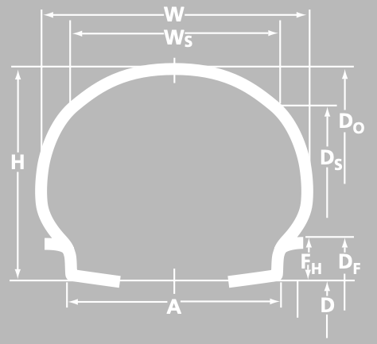

# Manufacturer Data 

To test and validate our program, we retrieved aircraft tire engineering data from Michelin Aircraft Tire. 

Specifically, we focused on bias type VII, presented with the three part (inch code) nomenclature. The file `tire_data.csv` is prepared with column names using the "Notation" column from the table below. 

| Category | Name | Unit | Notation | 
| :------- |:---- | :--- | :------- | 
| Tire Descriptions | Prefix | | Pre |
| | Nominal Overall Diameter | | M |
| | Nominal Section Width | | N |
| | Rim Diameter | | D |
| | Ply Rating | | PR |
| | Speed Index | mph | SI |
| Application Rating | Max. Loading | lbs | Lm |
| | Inflation Pressure (Unloaded) | psi | IP |
| | Approx. Bottoming Load | lbs | BL |
| Inflated Tire Dimensions | $D_o$ Max. | inches | DoMax|
| | $D_o$ Min. | inches | DoMin |
| | $W$ Max. | inches | WMax |
| | $W$ Min. | inches | WMin |
| | $D_s$ Max. | inches | DsMax |
| | $W_s$ Max. | inches | WsMax |
| Aspect Ratio | | | AR |
| Static Loaded Radius | At Rated Load | inches | LR_RL|
| | At Bottoming Load | inches | LR_BL |
| Rim Description | Width Between Flanges | inches | A |
| | Specified Rim Diameter | inches | D |
| | Flange Height ($F_H$) | inches | FH |
| | Min. Ledge Width | inches | G |
| | Outer Flange Diameter ($D_F$) | inches | DF |
| Qualification Standard | | | QS |
| | | | |

Notes: 
- The Three Part Nomenclature in tire descriptions may contain a prefix designation by B, C, H, or *. 
- \* in tire description prefix: this dimensional data for this size was defined in metric units which, for consistency, has been converted to english units.

## Inflated tire dimensions (at rated tire pressure)

- \* $D_O$: Outside Diameter
- \*\* $D_G$: Maximum Grown Overall Diameter
- \* $W$: Cross Section Width
- \*\* $W_G$: Maximum Grown Section Width
- \* $D_S$: Shoulder Diameter
- \*\* $D_{SG}$: Maximum Grown Shoulder Diameter
- \* $W_S$: Shoulder Width
- \*\* $W_{SG}$: Maximum Grown Shoulder Width
- \* $H$: Section Height
- \* $H_S$: Shoulder Height
- $A$: Width between Rim Flanges
- $D$: Specified Rim Diameter
- $F_H$: Rim Flange Height
- $D_F$: Rim Flange Diameter

Notes: 
- \*: Dimensions of new, unused inflated tire (after 24 hours) 
- \*\*: Dimensions of new, grown inflated tire (after 50 TSO take-off cycles).
 